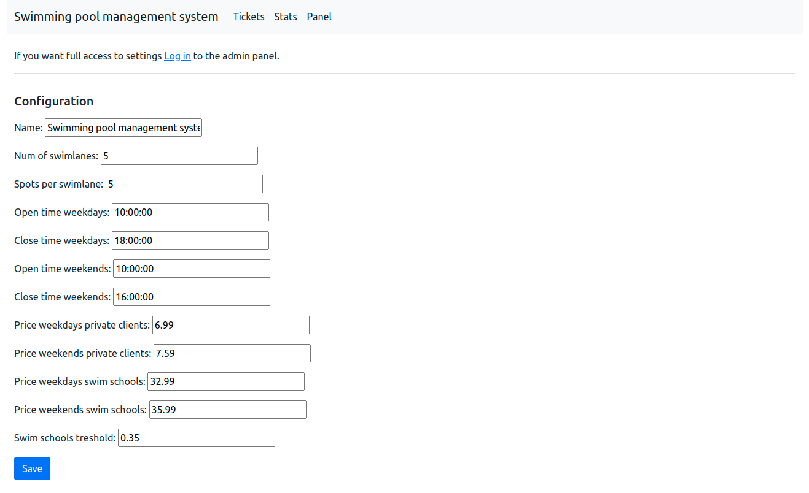

# Swimming pool management system
Swimming pool management system created using [Django](https://www.djangoproject.com/), Bootstrap5](https://getbootstrap.com/) and [Charts.js](https://www.chartjs.org/).

Project is divided into 3 modules:
- Tickets - responsible for creating reservations, generating tickets(QR codes), recording payments and displaying information about free swimlanes.
- Stats - contains charts displaying income data and amount of paid/unpaid reservations in particular months. This module also takes care of generating detailed reports for specific days.
- Panel - enables facility specifications customization e.g. modifying open/close time and tickets prices.

## Installation
1. Clone this repository: `git clone https://github.com/dawidkasz/swimming-pool-management-system.git`.
2. Install dependencies: `pip install -r requirements.txt`.
3. Put your individual Django Secret Key into the environment variable called **SWIMMING_POOL_MANAGEMENT_SYSTEM_SECRET_KEY**.
4. Run migrations: `python3 manage.py migrate`.
5. In order to run the project locally simply execute `python3 manage.py runserver`.

## Tickets
 - Make a reservation - choose date and time, client type(private client or swim school) and duration. System will check if it's possible to make a reservation with the given parameters. If so, then unique reservation code and ticket will be generated. Otherwise, algorithm will find the next available term and propose it.
- Pay for reservation - Provide ticket id or upload qr code in order to mark corresponding reservation as paid.
- Swimlanes info - Information about free spots on particular swimlanes at the time.

## Stats
- Monthly income - chart shows income generated by private clients and swim schools.
- Monthly amount of paid/unpaid reservations - shows how many reservations were mark as paid in certain months.
- Generate detailed report - returns a file containg general stats from certain day as well as full list of reservations in csv format.

## Panel
Allows user to set project's individual parameters.

