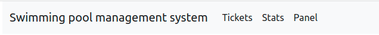
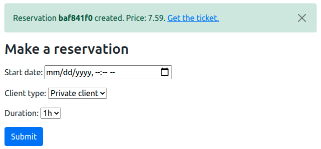
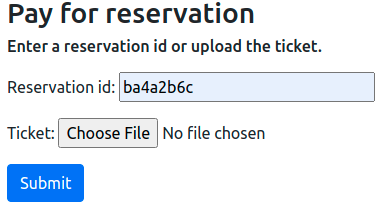
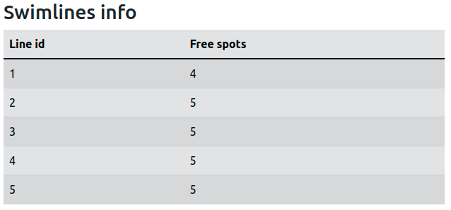
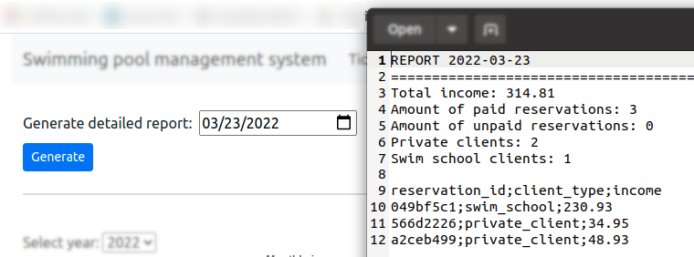
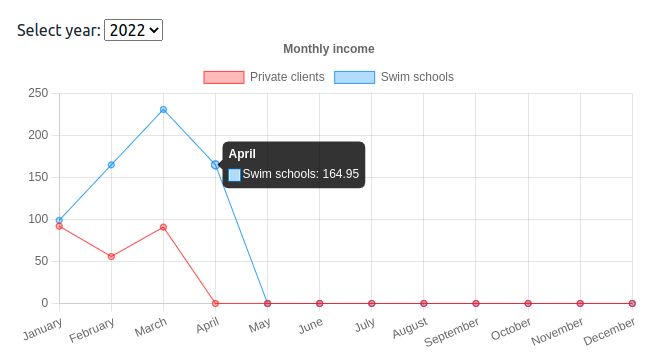
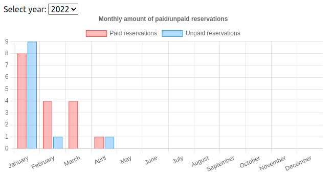
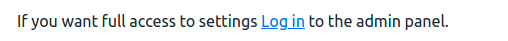
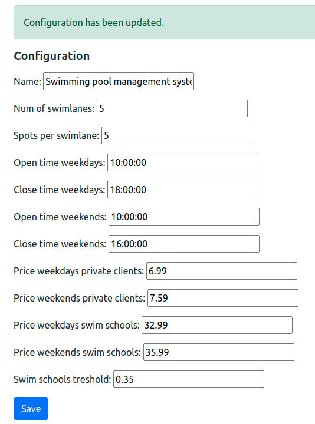

# Dokumentacja

## Instalacja
1. Sklonować repozytorium. 
    `git clone https://gitlab-stud.elka.pw.edu.pl/dkaszyns/swimming-pool-management-system.git`
2. Zainstalować wymagane zależności z pliku [requirements.txt](../../requirements.txt). 
   Przykład: 
   - `python3 -m venv venv`
   - `source ./venv/bin/activate`
   - `pip install -r requirements.txt`
3. Utworzyć zmienną środowiskową o nazwie `SWIMMING_POOL_MANAGEMENT_SYSTEM_SECRET_KEY` zawierającą sekretny klucz wykorzystywany przez Django. 
    Klucz można wygenerować online [djecrety.ir](https://djecrety.ir/) lub bezpośrednio z poziomu konsoli. 
   Przykład generowania sekretnego klucza:
   - `python3 manage.py shell`
   - `from django.core.management.utils import get_random_secret_key`
   - `get_random_secret_key()`

     Wygenerowany klucz należy umieścić w zmiennej środowiskowej: 
    `export SWIMMING_POOL_MANAGEMENT_SYSTEM_SECRET_KEY='<wygenerowany_klucz>'`

4. Wykonać migrację w celu utworzenia utworzenia odpowiedniej struktury bazy danych. 
   `python3 manage.py migrate`

## Uruchomienie
W celu uruchomienia aplikacji należy wykonać polecenie `python3 manage.py runserver <opcjonalny_adres>`. 
Domyślnie serwer będzie działał na `http://127.0.0.1:8000/`.

W momencie uruchomienia produkcyjnego, należy pamiętać o ustawieniu parametru `DEBUG = False`
w pliku [settings.py](../../swimming_pool_management_system/settings.py)

## Testowanie
Testy jednostkowe dla każdego z modułów znajdują się w plikach `tests.py` w odpowiednich katalogach. 
Aby uruchomić testy należy wykonać polecenie `python3.9 manage.py test` lub `python3.9 manage.py test <nazwa_aplikacji>`, w momencie gdy  
chcemy przetestować tylko i wyłącznie jeden moduł.

Wszystkie developerskie zależności z pliku [requirements-dev.txt](../../requirements-dev.txt)
można zainstalować poprzez `pip install -r requirements-dev.txt`

Domyślnie wykorzystywanym linterem jest [flake8](https://flake8.pycqa.org/en/latest/)
wraz z następującą [konfiguracją](../../.flake8). 

## Użytkowanie
Przechodzenie pomiędzy poszczególnymi modułami umożliwa pasek nawigacyjny w górnej części ekranu.

### Tickets
Moduł Tickets odpowiada za tworzenie / opłacanie rezerwacji oraz wyświetlanie liczby wolnych miejsc na torach pływackich w danym momencie. 
Każda rezerwacja domyślnie jest oznaczona jako nieopłacona i nie wlicza się do przychodów pływalni, aż do momentu opłacenia biletu. 
Rezerwacja dokonana na klienta indywidualnego powoduje rezerwację jednego wolnego miejsca na pierwszym wolnym torze, natomiast 
gdy klientem jest szkółka pływacka rezerwowany jest pierwszy dostępny cały tor.

Przykładowa interakcja z użytkownikiem może wyglądać następująco:
1. Pracownik pływalni wprowadza do systemu dane dotyczące rezerwacji. W odpowiedzi zwracany jest unikalny identyfikator oraz bilet w postaci kodu QR, które 
  zostają przekazane klientowi składającemu zamówienie.
2. W późniejszym terminie klient postanawia opłacić zamówienie. W tym celu przekazuje pracownikowi pływalni bilet lub identyfikator swojego zamówienia. 
   Pracownik wprowadza jedno z dwóch do systemu, a po walidacji przekazanych danych rezerwacja zostaje opłacona.

**Formularz służący do tworzenia rezerwacji**

**Formularz służący do opłacania rezerwacji**

**Podgląd na liczbę wolnych miejsc na torach pływackich w danym momencie**

### Stats
Moduł Stats udostepnia wgląd w statystyki dotyczące funkcjonowania pływalni, takich jak:
- **Generowanie raportów detalicznych z danego dnia**

- **Wykres przedstawiający przychód pływalni w poszczególnych miesiącach z uwzględnieniem typu klienta**

- **Wykres przedstawiający liczbę opłaconych i nieopłaconych rezerwacji w poszczególnych miesiącach**

### Panel
Moduł Panel umożliwia konfigurację systemu do zarządzania pływalnią oraz ewentualnie dostęp 
do panelu administracyjnego, w przypadku, gdy w systemie istnieje takie konto. 
Konto administracyjne można stworzyć poprzez polecenie `python3 manage.py createsuperuser`.

Możliwe jest modyfikowanie następujących parametrów:
- **Name** - nazwa pływalni wyświetlana na pasku nawigacyjnym oraz na pasku adresu.
- **Num of swimlanes** - liczba dostępnych torów pływackich.
- **Spots per swimlane** - liczba wolnych miejsc na każdym z torów.
- **Open time weekdays** - godzina otwarcia w dni powszednie.
- **Close time weekdays** - godzina zamknięcia w dni powszednie.
- **Open time weekends** - godzina otwarcia w weekendy.
- **Close time weekends** - godzina zamknięcia w weekendy.
- **Price weekdays private clients** - cena dla klientów indywidualnych w dni powszednie.
- **Price weekends private clients** - cena dla klientów indywidualnych w weekendy
- **Price weekdays swim schools** - cena dla szkółek pływackich w dni powszednie.
- **Price weekends swim schools** - cena dla szkółek pływackich w weekendy
- **Swim schools treshold** - Maksymalny odsetek torów zarezerwowanych w jednym momencie przez szkółki pływackie.

**Odnośnik do panelu administracyjnego**

**Formularz służący do konfigurowania systemu**

## Struktura projektu

### [swimming_pool_management_system](../../swimming_pool_management_system)
- [settings.py](../../swimming_pool_management_system/settings.py) - plik zawierający ustawienia projektu.
- [urls.py](../../swimming_pool_management_system/urls.py) - mapuje odpowiednie adresy URL na funkcje obsługujące dane zapytania. 
  Podpięte są pod niego także inne pliki `urls.py` z poszczególnych modułów.

### [tickets](../../tickets)
- [models.py](../../tickets/forms.py) - definicja modelu `Reservation` przechowywanego w bazie danych.
- [forms.py](../../tickets/forms.py) - zawiera logikę dla dwóch głównych formularzy renderowanych w module tickets: 
  `ReservationForm`(tworzenie rezerwacji) oraz `PayForReservationForm`(opłacanie rezerwacji).
- [utils.py](../../tickets/utils.py) - funkcje odpowiadające za logikę modułu np. pobieranie informacji o liczbie dostępnych miejsc na torach, 
  sprawdzanie czy placówka jest w danym terminie otwarta i jaka powinna być cena biletu dla danego klienta w danym dniu.
- [views.py](../../tickets/views.py) - funkcje wykorzystujące logikę modułu do renderowania odpowiedniego widoku HTML oraz odpowiedzialne za obsługę 
  odpowiednich zapytań wysyłanych z formularzy lub żądających zwrócenia kodu qr.
- [tests.py](../../tickets/tests.py) - testy jednostkowe dla modułu tickets.

### [stats](../../static)
- [views.py](../../stats/views.py) - renderowanie głównego widoku modułu stats, a także funkcje obsługujące REST API, które zwraca 
  dane dotyczące statystyk funkcjonowania pływalni.
- [utils.py](../../stats/utils.py) - funkcje przygotowujące i przetwarzające dane dotyczące pływalni zanim zostaną zwrócone przez API.
- [tests.py](../../stats/tests.py) - testy jednostkowe dla modułu stats.

### [panel](../../panel)
- [models.py](../../panel/models.py) - definicja modelu `SiteConfiguration`, który przechowuje konfigurację pływalni. Jest on obiektem 
  typu singleton, zatem w jednym momencie w bazie danych może znajdowac się tylko jedna instancja konfiguracji projektu. 
  Do zrealizowania logiki singletona wykorzystany został moduł [django-solo](https://github.com/lazybird/django-solo).
- [forms.py](../../panel/forms.py) - formularz `ConfigurationForm` umożliwiający modyfikację instancji modelu `SiteConfiguration`.
- [utils.py](../../panel/utils.py) - funkcja zwracająca instancję modelu `SiteConfiguration` (konfigurację projektu) z bazy danych.
- [views.py](../../panel/views.py) - obsługa widoku HTML modułu panel.
- [tests.py](../../panel/tests.py) - testy jednostkowe dla modułu panel.

### [templates](../../templates)
Globalnie wykorzystywane szablony HTML. Szablony dla poszczególnych modułów znajdują się w katalogach `<nazwa_modułu>/templates/<nazwa_modułu>`.

### [static](../../static)
Katalog zawierający pliki dołączane do szablonów HTML: funkcje obsługujące wyświetlanie wykresów, pobieranie raportu, zamykanie wiadomości.

### [docs](../)
Katalog zawierający dokumentację techniczną i użytkową projektu.
